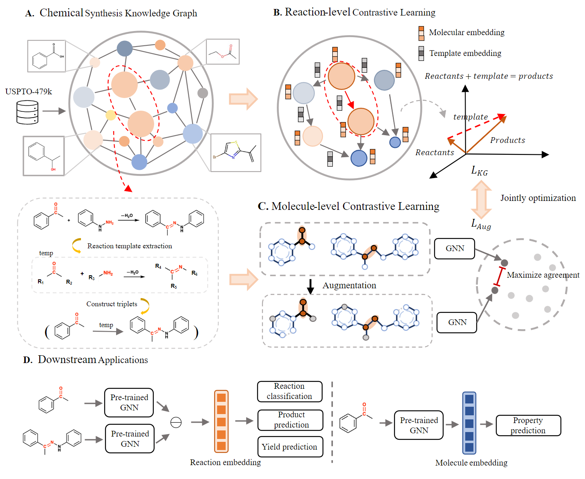

# ReaKE

Source code for "Chemical Synthesis Prediction through Contrastive Molecular Representation Learning with Reaction Knowledge Graph"



# Dataset

We provide the datasets here for those interested in our paper:
The reaction datasets used in this study are stored in `./data/`

# System requirement

ReaKE is mainly based on the following packages:

- python 3.9.16
- rdkit 2023.3.1
- numpy 1.24.3
- pytorch 1.12.1+cu116
- dgl 0.9.0

Also you can install the required packages follow there instructions (tested on a linux terminal):

```
conda env create -f environment.yaml
```

# Usage

### Pre-training

for pre-training:

```
cd src
python main.py --task pretrain --gnn tag
```

We  provided the pre-trained GNN model in ``./saved/``, including GCN, GAT, GraphSAGE and TAG.  

### Downstream tasks

for reaction classification:

```
cd src
python main.py --task reaction_classification --pretrained_model tag_f00 --dataset schneider --batch_size 200
```

for yield prediction:

```
cd src
python main.py --task yield_prediction --pretrained_model tag_f00 --dataset buchwald_hartwig --batch_size 200
```

# Citation and contact

Citation:

Contact:
In case you have questions, please contact Jiancong Xie: xiejc3@mail2.sysu.edu.cn